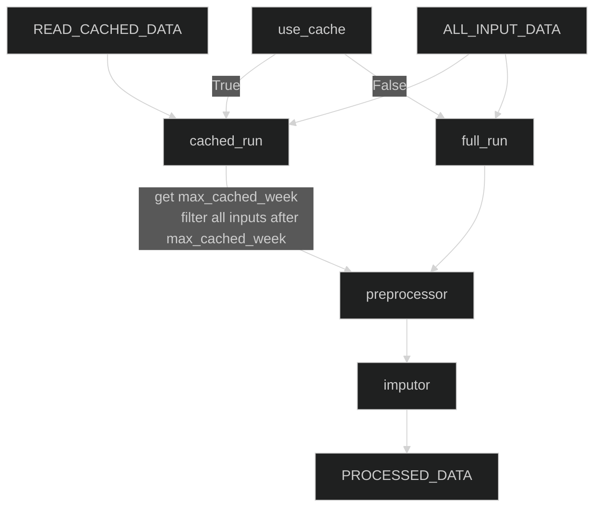

## Cache flow

```mermaid
%%{init: {'theme':'dark'}}%%
  graph TD
      use_cache -- True --> cached_run
      use_cache -- False --> full_run
      READ_CACHED_DATA --> cached_run -- "
        get max_cached_week
        filter all inputs after max_cached_week
      " --> preprocessor
      ALL_INPUT_DATA --> cached_run
      ALL_INPUT_DATA --> full_run --> preprocessor
      preprocessor --> imputor --> PROCESSED_DATA

```

## FPL Data flow
